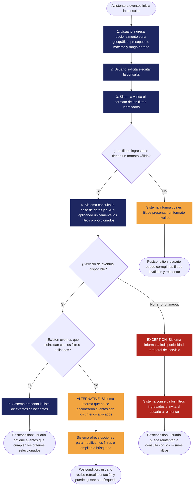

<!--

-->

# REQ-01 — Filtrado de eventos

| | |
|---|---|
| **Estado** | validado |
| **Equipo** | Cristian Andres Diaz Ortega - Juan Sebastian Rodriguez Carvajal - Martin Lora Caro - Justin David Vargas Vasquez -Nicolas David Lovera Cabiativa|
| **Fecha** |9/10/2026|
| **Historia de usuario relacionada** |US-01.1|

---

## 1. General

**Requerimiento**
> El sistema debe permitir al usuario consultar y filtrar eventos ingresando su presupuesto máximo, su rango de disponibilidad horaria y su zona geográfica (país, departamento/estado y ciudad).

**Tipo:** Funcional *(Sigue existiendo pasando por el filtro de la computadora perfecta: el usuario aun así necesita colocar los filtros para encontrar los eventos compatibles)* 

**Fuente/Evidencia**
> necesidades del usuario: NEED-01: "El usuario necesita encontrar actividades acordes a su dinero disponible, tiempo libre y la zona donde se ubica"

**Necesidad**
> Encontrar eventos acordes al usuario.

**Valor**
> el usuario encuentra eventos a los que tiene la posibilidad de asistir.

---

## 2. Contexto

**Reglas de negocio**

> BR-01 Para eventos con cupos máximos, solo se muestran los eventos que cuenten con al menos **1 cupo y/o entrada disponible** al momento de procesar la consulta. Los eventos agotados quedan excluidos de la lista general.

> BR-02 En eventos con múltiples tipos de entrada (por ejemplo, **General $20.000** y **VIP $50.000**), el evento califica como resultado válido si **al menos una de sus tarifas vigentes es menor o igual al presupuesto máximo** establecido por el usuario.

> BR-03 El usuario puede ingresar cualquier combinación de filtros (incluso ninguno); la consulta se realizará solo sobre los filtros ingresados. Sino se ingresa ningún filtro, se muestran eventos aleatorios.

**Restricción(es)** 
> La solución debe manejar con precaución la información de eventos públicos de terceros (Apis externas), porque existe la posibilidad de cambios en el evento. Controlamos la visualización de eventos públicos de terceros, pero no tenemos control de todo el ciclo de vida del evento.

**Supuesto(s)**
> Existen eventos en nuestra base de datos y Apis de terceros.
> Los eventos  son verídicos y legales. 

**Dependencias**
> Apis externas (para los eventos que se consultan de una Api externa).

**Riesgos**

| Riesgo | Probabilidad | Impacto | Mitigación (opcional) |
|---|---|---|---|
| La base de datos no responde | bajo | el usuario no puede encontrar eventos | Sistema informa la indisponibilidad temporal del servicio | 
| No hay eventos que cumplan con los filtros dados | mediano | El usuario no puede encontrar eventos | Sistema informa que no existen eventos con los filtros exactos y muestra recomendaciones para flexibilizar la búsqueda |

**Open Questions**
> N/A

---

## 3.Prioridad y estimación

**Prioridad asignada:**
> Asignamos Must have (Imprescindible) debido a que tener la facilidad de encontrar eventos en un horario,presupuesto y zona geográfica compatibles es la funcionalidad fundamental del sistema para encontrar actividades que el usuario pueda hacer. Aceptamos el costo de postergar filtros secundarios como categoría de evento, accesibilidad del recinto o vista en mapa interactivo para esta iteración. Consideramos la opción Should have y la rechazamos porque lanzar la búsqueda sin estos tres criterios básicos entregaría resultados irrelevantes, haciendo inviable la experiencia clave de descubrimiento de eventos en el MVP.

**Estimación (confianza):** Media
> Entendemos bien la lógica de filtrado directo por presupuesto máximo y zona geográfica (son consultas estándar a nivel de base de datos). Lo que genera incertidumbre y reduce la confianza de High a Medium, es el algoritmo de coincidencia para la disponibilidad horaria, especialmente al evaluar eventos que abarcan múltiples días, manejar diferencias de zonas horarias o procesar solapamientos parciales de tiempo sin degradar el rendimiento de la consulta.*

---

## 4. Representaciones

### 4.1 Historia de usuario

> Como asistente a eventos,
quiero encontrar actividades que se ajusten a mi presupuesto máximo, mi disponibilidad horaria y zona geográfica,
para obtener información sobre eventos a los que pueda asistir.

### 4.2 Criterios de aceptación

>**Escenario 1 — eventos filtrados**
Dado que el usuario se encuentra en la pantalla de búsqueda de actividades
cuando ingresa como presupuesto máximo "$50.000 pesos", selecciona el país "Colombia" y define un rango de disponibilidad de "18:00 a 22:00"
Entonces el sistema muestra la lista de eventos cuya ubicación sea Colombia, su tarifa mínima sea menor o igual a $50.000 pesos y su horario de inicio y fin esté totalmente contenido entre las 18:00 y las 22:00

>**Escenario 2 — sin eventos compatibles**
Dado que no existen eventos registrados en la ciudad "Medellín" con precio menor a "$10.000 pesos" dentro del rango de "08:00 a 12:00"
cuando el usuario ejecuta una búsqueda en Medellín con presupuesto máximo de "$10.000 pesos" y rango de disponibilidad de "08:00 a 12:00"
entonces el sistema muestra un mensaje indicando que no se encontraron actividades con esos criterios y sugiere ampliar el rango horaria o ajustar el presupuesto

>**Escenario 3 — eventos gratis**
Dado que existen eventos públicos de entrada libre ($0 pesos) en la ciudad seleccionada durante el rango de disponibilidad del usuario
cuando el usuario realiza la búsqueda ingresando un presupuesto máximo de "$0 pesos"
entonces el sistema retorna únicamente los eventos con tarifa de acceso de $0 pesos que coincidan con la ciudad y el rango de horario especificados

>**Escenario 4 — Búsqueda parcial y límite de resultados**
Dado que existen 15 eventos registrados en la ciudad "Bogotá"
cuando el usuario realiza una búsqueda seleccionando únicamente la ciudad "Bogotá" sin ingresar presupuesto ni rango horario
entonces el sistema muestra los 15 eventos.

>**Escenario 5 — Sin filtros**
Dado que el usuario no ingresa ningún filtro
cuando el usuario ejecuta la búsqueda
entonces el sistema muestra eventos aleatorios.

### 4.3 Caso de uso

| Campo | |
|---|---|
| **Nombre** |Consultar y Filtrar Eventos |
| **Rol** |Asistente a eventos |
| **Objetivo** |Encontrar eventos que coincidan con su presupuesto disponible, rango de horario y ubicación geográfica |
| **Activador** |ingresar sus filtros de búsqueda y ejecutar la consulta |
|**Condición previa** |El sistema se encuentra operativo y dispone de un catálogo de eventos registrados |

**Flujo Principal**\
1.El usuario ingresa la zona geográfica, establece su presupuesto máximo disponible y define un rango de disponibilidad horaria (hora inicio y fin).\
2.El usuario solicita la ejecución del filtro.\
3.El sistema valida que los campos ingresados sean acordes con el formato esperado.\
4.El sistema consulta la base de datos con los filtros aplicados.\
5.El sistema presenta al usuario la lista de eventos que cumplen con los filtros.

**Flujo Alternativo**
> Sin coincidencias para los criterios ingresados → El sistema informa al usuario que no existen eventos disponibles con los filtros exactos seleccionados y muestra recomendaciones para flexibilizar la búsqueda (ampliar rango de horario o ajustar presupuesto).

**Excepción**
> Fallo de disponibilidad en el servicio de eventos → El sistema detecta un error de conexión o tiempo de espera agotado en la base de datos; despliega un mensaje notificando la indisponibilidad temporal e invita a reintentar manteniendo los filtros ingresados en pantalla.

**Condición posterior**
> El usuario obtiene una vista clara de las opciones de eventos compatibles con sus restricciones o la retroalimentación correspondiente si no hay disponibilidad.

**Diagrama de flujo**

---
## 5. Trazabilidad e impacto

**Antecedente**
> Necesidad Need 01 ("El usuario necesita encontrar eventos que se ajusten a su presupuesto máximo, su rango de disponibilidad horaria y su ciudad.") → REQ-01.

**Efectos**
> REQ-01 → Diseño futuro (un componente de búsqueda, más una capa de integración para el proveedor de eventos publicos) → Implementación → Pruebas (AC-01.1 y AC-01.2 como base de verificación). (El diseño aún no se ha realizado; esta sección se completará una vez que comience el trabajo de Clase 11).

**Análisis de impacto**
- [ ] Reglas de negocio 
- [x] Restricción(es)
- [x] Dependencias
- [x] Riesgos
- [x] Criterios de aceptación
- [x] Estimación (confianza)
- [ ] Prioridad 
- [x] Diseño futuro
- [x] Futuras pruebas

> Si cambia un proveedor de eventos, las Restricciones, Dependencias, Riesgos, y el Diseño y las Pruebas futuras necesitarían revisión — la integración, los contratos de datos y los escenarios de fallo dependen directamente de ese proveedor. Las Reglas de Negocio y la Prioridad no se cambia: BR-01, BR-02 y BR-03 son reglas de dominio, y la Prioridad depende de la necesidad del usuario (Need-01), no de los detalles técnicos de implementación. Por eso quedan sin marcar.

---

## 6. Validación

- [x] **Válido?** Si, sale directamente de Need-01 y US-01.
- [x] **Claro?** Si, "consultar y filtrar eventos por presupuesto máximo, rango de disponibilidad horaria y zona geográfica" tiene una lectura razonable única para eventos.
- [x] **Atómico?** Si, es una única expectativa verificable de forma independiente (filtrar y listar eventos), no varias capacidades distintas empaquetadas juntas.
- [x] **Necesario?** Si, removerlo elimina la funcionalidad central de descubrimiento del MVP, la cual responde directamente al Need-01.
- [x] **Alcanzable?** Si, filtros por presupuesto y zona geográfica son consultas estándar; el filtro por horario es alcanzable aunque con mayor costo por eventos multi-día, zonas horarias y solapamientos parciales.
- [x] **Verificable?** Si, AC-01.1 a AC-01.5 dan condiciones de paso/fallo observables y concretas.
- [x] **Consistente?** Si, no se identificó conflicto con otras reglas del mismo conjunto; BR-01 y BR-02 son coherentes con los criterios de aceptación.
- [x] **Completo?** Si, Se define los filtros que se van a usar y cómo se comporta esta parte del sistema
- [x] **trazable?** Sí, cada sección anterior remite a evidencia real.
      
      
