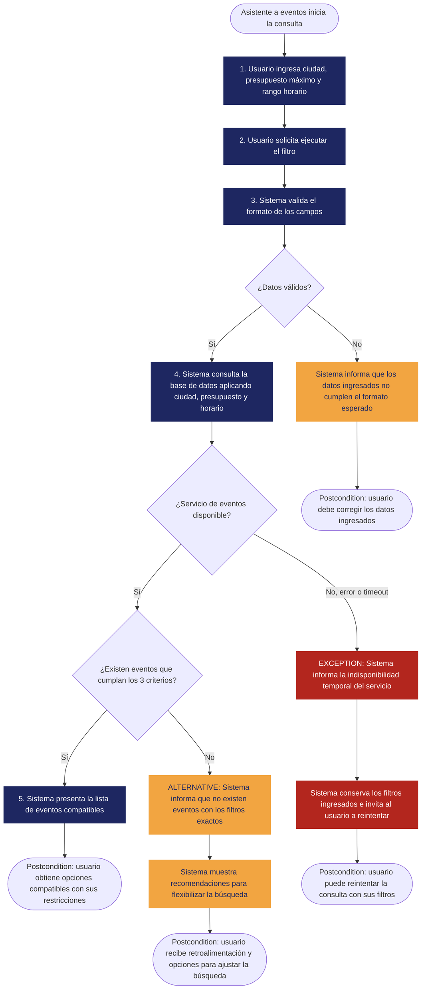

<!--
HOW TO USE THIS TEMPLATE
------------------------
1. Copy this file and rename it to the requirement's ID, e.g. REQ-01.md.
2. Fill in every section. If a section genuinely does not apply to this
   requirement (not every requirement has a Business Rule or a Constraint),
   write "N/A — none identified" and say why in one line. Never invent
   content to fill a blank cell — that breaks the rule we've followed since
   Class 8: specification is not invention.
3. If something is unknown rather than inapplicable, use the Open
   Questions section instead of guessing.
4. See REQ-07_Example.md (Food Delivery System) for a fully filled-in
   reference before you start.
-->

# [REQ-ID] — [Short Requirement Title]

| | |
|---|---|
| **Status** | Draft / Validated / Open Question |
| **Team / Author(s)** | |
| **Date** | |
| **Linked User Story / AC** | |

---

## 1. Overview

**Requirement Statement**
> El sistema debe permitir al usuario consultar y filtrar eventos ingresando su presupuesto máximo, su rango de disponibilidad horaria y su ciudad.

**Type:** Functional / Non-functional
*El requerimento es funcional*

**Source / Evidence**
> discusion con el equipo.

**Need**
> El usuario necesita encontrar eventos que se ajusten a su presupuesto maximo, su rango de disponibilidad horaria y su ciudad.

**Value / Rationale**
> el usuario encontra eventos a los que tiene la posibilidad de asistir*

---

## 2. Context — A Requirement Rarely Stands Alone

**Business Rule(s)**

- Solo se muestran eventos que cuenten con al menos **1 cupo o entrada disponible para venta** al momento de procesar la consulta. Los eventos agotados quedan excluidos de la lista general.

- En eventos con múltiples tipos de entrada (por ejemplo, **General $20** y **VIP $50**), el evento califica como resultado válido si **al menos una de sus tarifas vigentes es menor o igual al presupuesto máximo** establecido por el usuario.

- Si existen **más de 10 eventos** que coinciden con la búsqueda del usuario, el sistema muestra **un máximo de 10 resultados inicialmente**. La opción de mostrar más resultados estará disponible únicamente si el usuario lo solicita.

- El sistema permite realizar consultas utilizando **cualquier combinación de los tres filtros** disponibles, incluyendo la posibilidad de realizar una consulta **sin aplicar ningún filtro**.

**Constraint(s)**
> What limits how this requirement can be solved (regulation, existing technology, contract, interoperability, organizational policy)? A constraint reduces the available design space — it doesn't describe what must be satisfied, it describes what limits the solution.

**Assumption(s)**
> La infomracion de los eventos almacenados en la base de datos es verídica.

**Dependenc(ies)**
> El requierimiento depende de la base de datos del sistema.

**Risk(s)**

| Risk | Likelihood | Impact | Mitigation (optional) |
|---|---|---|---|
| La base de datos no responde | alto | el usuario no puede encontrar eventos |N/A|
| No hay eventos que cumplan con los filtros dados | mediano | El usuario no puede encotrar eventos |N/A|

**Open Questions**
> N/A

---

## 3. Priority & Estimation

**Priority assigned:**
> Asignamos Must have debido a que tener la facilidad de encontrar eventos en un horario,presupuesto y ciudad compatibles es la funcionalidad fundamental del sistema para encopntrar actividades que el usuario pueda hacer. Aceptamos el costo de postergar filtros secundarios como categoría de evento, accesibilidad del recinto o vista en mapa interactivo para esta iteración. Consideramos la opción Should have y la rechazamos porque lanzar la búsqueda sin estos tres criterios básicos entregaría resultados irrelevantes, haciendo inviable la experiencia clave de descubrimiento de eventos en el MVP.

**Estimate (confidence):** Medium
> Entendemos bien la lógica de filtrado directo por presupuesto máximo y ciudad (son consultas estándar a nivel de base de datos). Lo que genera incertidumbre y reduce la confianza de High a Medium es el algoritmo de coincidencia para la disponibilidad horaria, especialmente al evaluar eventos que abarcan múltiples días, manejar diferencias de zonas horarias o procesar solapamientos parciales de tiempo sin degradar el rendimiento de la consulta.*

---

## 4. Representations — Requirement ≠ Representation

*(Class 9. Each representation reveals different information. Fill in all three below — for this capstone requirement, all three are required.)*

### 4.1 User Story

> Como asistente a eventos,
quiero filtrar las actividades disponibles según mi presupuesto máximo, mi disponibilidad horaria y mi ciudad,
para poder encontrar rápidamente eventos reales a los que sí pueda asistir.

*Check yourself: is the "I want" describing the need, or already prescribing a solution?*

### 4.2 Acceptance Criteria

*(At least two scenarios: one normal path, one alternative or exception.)*

**Scenario 1 — [short name]**
Dado que el usuario se encuentra en la pantalla de búsqueda de actividades
cuando ingresa como presupuesto máximo "$50 USD", selecciona la ciudad "Bogotá" y define un rango de disponibilidad de "18:00 a 22:00"
Entonces el sistema muestra la lista de eventos cuya ubicación sea Bogotá, su tarifa mínima sea menor o igual a $50 USD y su horario de inicio y fin esté totalmente contenido entre las 18:00 y las 22:00

**Scenario 2 — [short name, alternative or exception]**
Dado que no existen eventos registrados en la ciudad "Medellín" con precio menor a "$10 USD" dentro del rango de "08:00 a 12:00"
cuando el usuario ejecuta una búsqueda en Medellín con presupuesto máximo de "$10 USD" y rango de disponibilidad de "08:00 a 12:00"
enotnces el sistema muestra un mensaje indicando que no se encontraron actividades con esos criterios y sugiere ampliar el rango horaria o ajustar el presupuesto

**Scenario 3 — [short name, alternative or exception]**
Dado que existen eventos públicos de entrada libre ($0 USD) en la ciudad seleccionada durante el rango de disponibilidad del usuario
cuando el usuario realiza la búsqueda ingresando un presupuesto máximo de "$0 USD"
entonces el sistema retorna únicamente los eventos con tarifa de acceso de $0 USD que coincidan con la ciudad y el rango de horario especificados

### 4.3 Use Case

| Field | |
|---|---|
| **Use Case name** |Consultar y Filtrar Eventos |
| **Actor** |Asistente a eventos |
| **Goal** |Encontrar eventos que coincidan con su presupuesto disponible, rango de horario y ubicación geográfica |
| **Trigger** | El usuario ingresa sus filtros de búsqueda y ejecuta la consulta |
|**Precondition** |El sistema se encuentra operativo y dispone de un catálogo de eventos registrados |

**Main Flow**
1.El usuario ingresa la ciudad objetivo, establece su presupuesto máximo disponible y define un rango de disponibilidad horaria (hora inicio y fin).
2.El usuario solicita la ejecución del filtro.
3.El sistema valida que los campos ingresados sean acordes con el formato esperado.
4.El sistema consulta la base de datos con los filtros aplicados.
5.El sistema presenta al usuario la lista de eventos organizados que cumplen simultáneamente con los tres criterios.

**Alternative Flow**
> Sin coincidencias para los criterios ingresados → El sistema informa al usuario que no existen eventos disponibles con los filtros exactos seleccionados y muestra recomendaciones para flexibilizar la búsqueda (ampliar rango de horario o ajustar presupuesto).

**Exception**
> Fallo de disponibilidad en el servicio de eventos → El sistema detecta un error de conexión o tiempo de espera agotado en la base de datos; despliega un mensaje notificando la indisponibilidad temporal e invita a reintentar manteniendo los filtros ingresados en pantalla.

**Postcondition**
> El usuario obtiene una vista clara de las opciones de entretenimiento compatibles con sus restricciones o la retroalimentación correspondiente si no hay disponibilidad.

**Flow Diagram**
*(Replace the labels below with your own steps. Keep Main Flow, Alternative, and Exception visually distinct — delete whichever branch doesn't apply to your use case. This renders automatically on GitHub.)*

---
## 5. Traceability & Impact

**Backward — why does this requirement exist?**
> Evidence → Need → Requirement. Point to the specific evidence/need entries that justify this requirement (from your Discovery Sheet).

**Forward — what will this affect?**
> Requirement → future Design → Implementation → Tests. *(It's fine if Design hasn't happened yet — note what you expect this to touch once it does, and update this section once Class 11 work begins.)*

**Impact Analysis — if this requirement changes, what else might need to change?**
- [ ] Business Rules
- [x] Constraints
- [x] Dependencies
- [x] Risks
- [x] Acceptance Criteria
- [x] Estimate
- [ ] Priority
- [x] Future Design
- [x] Future Tests

> Briefly note which of the above are actually likely to be affected, and why.

---

## 6. Validation — Quality Gate

*(Class 9 + Class 10. Self-audit before you commit this file. Check honestly — a "no" here means the requirement isn't ready yet, not that you should force a checkmark.)*

- [x] **Valid?** Does it reflect a real, evidenced need — not an invented one?
- [x] **Clear / Unambiguous?** Is there only one reasonable interpretation?
- [x] **Atomic?** Is this one independently testable expectation, not several bundled together?
- [x] **Necessary?** Does removing it actually break something real?
- [x] **Feasible?** Can this realistically be built with what the team has?
- [x] **Verifiable?** Can you demonstrate, concretely, whether it's satisfied?
- [x] **Consistent?** Does it conflict with any other requirement in your set?
- [x] **Complete enough?** Are there important functions or constraints still missing?
- [x] **Traceable?** Can every part of this document be traced back to real evidence — not invented to fill a section?
      
